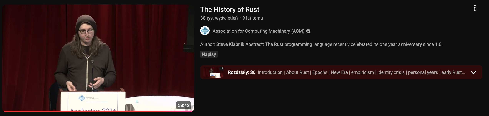
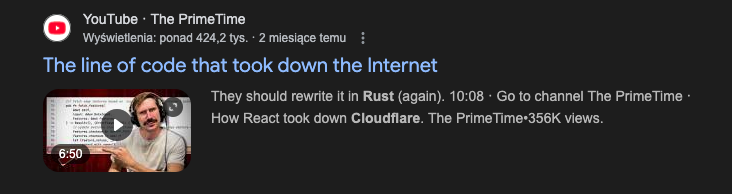
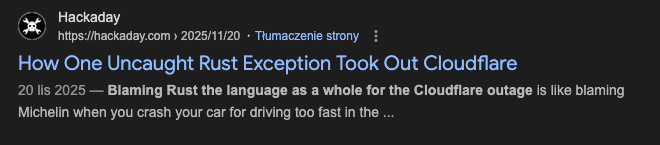
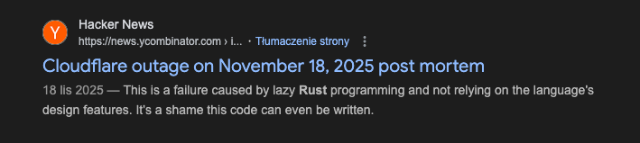
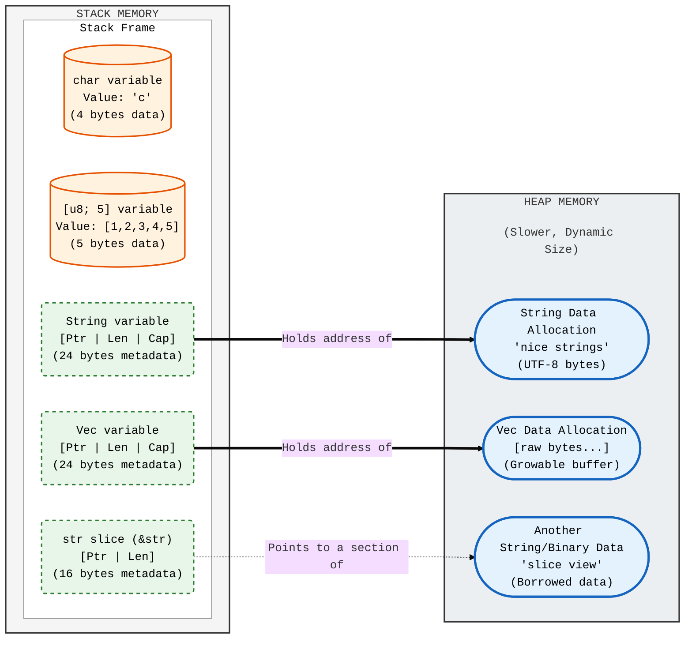
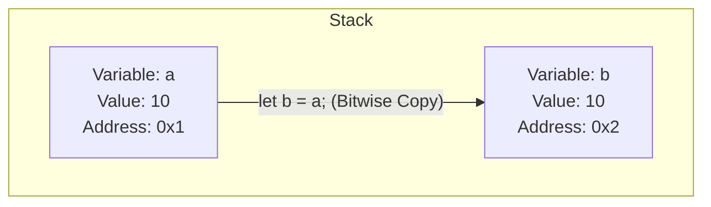
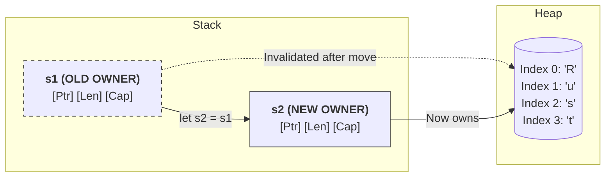
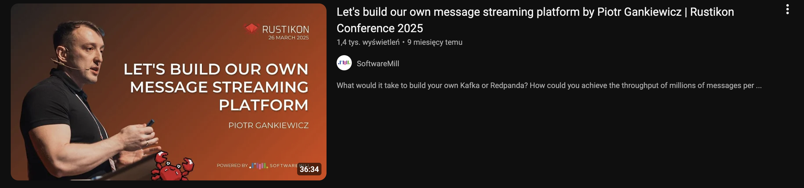

---

title: "Introduction to Rust programming language"
sub_title: ""
author: Rafał Draws

theme:
  name: tokyonight-storm
  override:
    footer:
      style: template
      center: 'Introduction to Rust programming language'
      right: "{current_slide} / {total_slides}"
      height: 3
    palette:
      classes:
        noice:
          foreground: red
---

Agenda
===

- A brief history of Rust
- Typesystem
- Memory Safety Core - Ownership, Borrowing, Lifetimes
- Heap and Stack (in short)
- Appliences
- How to start

<!-- end_slide -->


Who am I
===
<!-- column_layout: [2, 1] -->
<!-- column: 0 -->

Rafał Draws, MSc
<!-- pause -->
- SDE at Nordea Bank 
<!-- pause -->
- Rust Poland co-founder
<!-- pause -->
- Music nerd 
<!-- pause -->
- Automotive nerd 
<!-- pause -->

<!-- column: 1 -->


how can you tell that someone drives a Lexus?

<!-- pause -->

they'll tell you

<!-- pause -->


<!-- pause -->
yes its '99, has 300 thousand miles

<!-- end_slide -->


What is Rust?
===

"Rust is a general-purpose programming language. It is noted for its emphasis on performance, type safety, concurrency, and memory safety. 
<!-- pause -->

Rust supports multiple programming paradigms. It was influenced by ideas from functional programming, including immutability, higher-order functions, algebraic data types, and pattern matching.
<!-- pause -->

It also supports object-oriented programming via structs, enums, traits, and methods.

<!-- pause -->

Rust is noted for enforcing memory safety (meaning that all references point to valid memory) without a conventional garbage collector;

<!-- pause -->
 
instead, memory safety errors and data races are prevented by the "**borrow checker**", which tracks the object lifetime of references at compile time."

<!-- pause -->
~ Wikipedia

<!-- end_slide -->


<!-- column_layout: [1, 2, 1] -->

<!-- column: 1-->
But why Rust?
===

Canadian software developer Graydon Hoare, created Rust in 2006 while working at Mozilla as a side project.

He named the language after a specific type of fungi that is "over-engineered for survival".


<!-- column: 0-->

<!-- column: 1-->
<!-- new_line -->
<!-- new_line -->

<!-- column: 2 -->


<!-- end_slide -->


A brief history of Rust
===

Rust interpreter was first written in OCaml, and the language was inspired by programming languages from 1970-1990s, such as: CLU, BETA, Mesa, NIL, Erlang, Newsqueak, Napier, Hermes, Sather, Limbo and Alef.

<!-- speaker_note: 

Hoare described it as "technology from the past come to save the future from itself".


In 2012, in a interview by InfoQ, upon being asked a question: "Why would developers choose Rust", Graydon answered:
 -->

<!-- new_line -->
<!-- new_line -->

<!-- pause -->
<!-- column_layout: [1, 3] -->
<!-- column: 0 -->

<!-- column: 1 -->
- "*Our target audience is "frustrated C++ developers". I mean, that's _us_. So if you are in a similar situation we're in, repeatedly finding yourself forced to pick C++ for systems-level work due to its performance and deployment characteristics, but would like something safer and less painful, we hope we can provide that.*"

<!-- pause -->

And they did.

<!-- end_slide -->


Rust history over the years
===


<!-- incremental_lists: true -->
- 2006, Rust is created in Mozilla Labs

- 2012, Rust compiler is rewritten in Rust

- 2014, The "Great Simplification", introducing Ownership/Borrowing instead of Garbage Collection

- 2015, Rust 1.0 is released

- 2020, Discord rewrote Read states from Go to Rust to eliminate Garbage Collection spikes

- 2022, Rust merged into Linux Kernel && Cloudflare replaced Nginx with Pingora, proxy written in Rust

- 2024, White House endorses Rust explicitly urging the industry to adopt memory safe languages to secure national infrastructure

- 2025, Rust no longer experimental in Linux Kernel

<!-- end_slide -->

The History of Rust, by Steve Klabnik
===


```bash +exec +no_background
echo https://www.youtube.com/watch?v=79PSagCD_AY | qrencode -t utf8i
```

<!-- end_slide -->

How Rust puts emphasis on type safety?
===


1. Functions must take in typed parameters and return type.
2. Ownership, Borrowing and Lifetimes
3. No nulls (instead Option\<T\> and Result\<T, E\>)
4. Immutability by default
5. Exhaustive pattern matching
6. Fearless Concurrency (Send and Sync traits)


<!-- end_slide -->

How Rust puts emphasis on type safety? 
===


1. <span style="color: #00ff11">Functions must take in typed parameters and return type.
2. <span style="color: #00ff11">Ownership, Borrowing and Lifetimes
3. <span style="color: #00ff11">No nulls (instead Option\<T\> and Result\<T, E\>)</span>
4. Immutability by default 
5. <span style="color: #00ff11">Exhaustive pattern matching</span>
6. Fearless Concurrency (Send and Sync traits)

<!-- pause -->
Mutability must be defined explicitly with every variable

<!-- pause -->

```rust
# #[allow(unused)]
# fn main() {
  let immutable_string: String = "This is immutable String".to_string();

  let mut mutable_string_buffer = "This is mutable".to_string();
# }
```

<!-- pause -->
And as for 6. Fearless Concurrency - it deserves it's own talk

<!-- end_slide -->

Typesystem - primitive types
===

| Size | Signed Type | Unsigned Type  | Description |
| :--- | :--- | :--- | :--- |
| **8-bit** | i8 | u8 | Tiny integers (0 to 255 for u8), (-127 to 127 for i8) |
| **16-bit** | i16 | u16 | Small integers. (0 - 2^16 for u16) |
| **32-bit** | i32 | u32 | `i32 is the standard default integer in Rust` |
| **64-bit** | i64 | u64 | Large integers (64-bit precision). |
| **128-bit** | i128 | u128 | Massive integers for specialized math. |
| **Arch-dependent** | isize | `usize` | Matches your CPU pointer size (32 or 64-bit). |

<!-- pause -->
```rust +exec 
# fn main() {
    let ptr_size = std::mem::size_of::<usize>();
    
    println!("My architecture is {}-bit!", ptr_size * 8);
# }
```
<!-- end_slide -->


Typesystem pt.2
===

# Floating-Points Types

| Size | Type | Description |
| :--- | :--- | :--- |
| 32-bit | f32 | 32 bit floating point |
| 64-bit | f64 | 64 bit floating point, `default if not specified otherwise` |
<!-- pause -->

# Boolean type

| Size | Type | Description |
| :--- | :--- | :--- |
| 1 byte | true | It's true! |
| 1 byte | false | It's false! |


<!-- pause -->

<!-- end_slide -->
Typesystem pt.3
===

# TUPLE
```rust +exec 
# fn main() {
    let ip_address: (u8, u8, u8, u8) = (127, 0, 0, 1);
    let (a, b, c, d) = ip_address;

    println!("Ain't no place like {}.{}.{}.{}", a, b, c, d);

    println!("The first octet of an address - {}", ip_address.0);
    
# }
```

<!-- end_slide -->

Typesystem pt.4
===

# Array type
```rust +exec 
# #[allow(unused)]
# fn main() {
    let brtdz = [2,1,1,5];
    let zero_1d_tensor: [f64; 100] = [0.0; 100];

    println!("{:?}", brtdz);
    println!("{:?}", zero_1d_tensor);
# }
```

<!-- end_slide -->

Typesystem pt.5
===

<!-- speaker_note: 
Vector is heap allocated. It has a set of functions, and is very convinient way to store data.

Fun fact, heap allocated data is not permitted in NASA hardware, so no Vec's in space :(


 -->

# Vector
```rust +exec
# #[allow(unused)]
# fn main() {

  let first_valid_vec_of_i32: Vec<i32> = vec![-123, i32::MAX, 123, i32::MIN];
  let second_valid_vec: Vec<i32> = Vec::new();

  let mut stack: Vec<i32> = vec![0, 1, 3];
  let popped_from_stack = stack.pop();

  println!("Seems like Vec is just like array in python! {:?} == {:?}", 3, popped_from_stack.unwrap());

# }
```

<!-- end_slide -->
char, String, and string slice types
===
| Type | Stack Size | Description|
| :--- |  :--- | :--- |
| String |  24 bytes | Growable, UTF-8 encoded text. Used when you need to modify the data |
| &str |  16 bytes | a "slice" or view into the text. The metadata is on stack, but the data is somewhere else |
| char |  4 bytes | A single unicode scalar value, like 'c'. Always fixed at 4 bytes |
| [u8; `n`] | `n` bytes | Fixed size array of bytes |
| Vec\<u8\> | 24 bytes | A growable array of raw bytes, often used for non-textual data or manual encoding |

```rust +exec
# #[allow(unused)]
# fn main() {

  let s = String::from("I LOVE LANGUAGES WITH MULTIPLE STRING TYPES");
  let view: &str = &s;
  let char: char = s.chars().nth(2).unwrap();
  let bytes_array: &[u8] = &s.as_bytes()[0..5];
  let u8_vec: Vec<u8> = s.as_bytes().to_vec();

  println!("s: {:?}\nview: {:?}\nchar: {:?}\nbytes_array: {:?}\nu8_vec: {:?}\n", s, view, char, bytes_array, u8_vec);

# }
```

<!-- end_slide -->

Functions must take in typed parameters and return type. 
===

This won't compile:
```rust +exec
# fn main() {
fn eat_pizza(pizza) {
  if pizza.source == "piratto" {
    return "mmm yummy"
  } else {
    return "nice"
  }
}
# }

```

<!-- end_slide -->
Functions must take in typed parameters and have return type (unless they don't return anything). 
===

This will compile:
```rust +exec
# fn main() {
# struct Pizza<'a> {
#  source: &'a str
# }

fn eat_pizza(pizza: Pizza) -> &'static str {
  if pizza.source == "piratto" {
    return "mmm yummy"
  } else {
    return "nice"
  }
}

  let questionmark_pizza: Pizza = Pizza { source: "piratto" };
  let result = eat_pizza(questionmark_pizza);
  println!("{}", result);

# }
```

<!-- end_slide -->

There are no nulls in Rust
===
<!-- pause -->
except for std::ptr::null() but we like to pretend that there aren't :) 

<!-- end_slide -->

There are no nulls in Rust
===


### Sir Charles Antony Richard Hoare (what a coincidence!), a british computer scientist, inventor of Quicksort algorithm and grandfather of "design by contract" famously said:


<!-- pause -->

<!-- jump_to_middle -->

<!-- column_layout: [1, 4] -->
<!-- column: 0 -->


<!-- column: 1 -->
<!-- new_line -->
<!-- new_line -->
"I call it my billion-dollar mistake. It was the invention of the null reference in 1965. [...] This has led to innumerable errors, vulnerabilities, and system crashes, which have probably caused a billion dollars of pain and damage in the last forty years."

<!-- end_slide -->

So how do we omit nulls?
===

```rust
Option<T>
Result<Ok, Err>
```

Option of type \<T\> has two wariants, either Some(T) or None.

For example, if you're creating a pizza structure, you could do it this way:


<!-- end_slide -->

Let's make a pizza - inital struct
===

```rust
struct Pizza {
  source: Pizzeria,
  cheese: String,
  meat: Option<Vec<MeatIngridient>>,
  sauce: Option<Sauce>,
  veggies: Option<Veggie>
}
```


<!-- end_slide -->

Let's make a pizza - throw some meat
===

```rust
struct Pizza {
  source: Pizzeria,
  cheese: String,
  meat: Option<Vec<MeatIngridient>>,
  sauce: Option<Sauce>,
  veggies: Option<Veggie>
}

struct MeatIngridient(String)
```


<!-- end_slide -->

Let's make a pizza - source please?
===

```rust
struct Pizza {
  source: Pizzeria,
  cheese: String,
  meat: Option<Vec<MeatIngridient>>,
  sauce: Option<Sauce>,
  veggies: Option<Veggie>
}

struct MeatIngridient(String)

enum Pizzeria {
  PIRATTO,
  SOPRANO,
  DOLCEVITA,
  PARMA
}
```


<!-- end_slide -->
Let's make a pizza - other ingridients
===

```rust
struct Pizza {
  source: Pizzeria,
  cheese: String,
  meat: Option<Vec<MeatIngridient>>,
  sauce: Option<Sauce>,
  veggies: Option<Veggie>
}

struct MeatIngridient(String)

enum Pizzeria {
  PIRATTO,
  SOPRANO,
  DOLCEVITA,
  PARMA
}

enum Sauce {
  BIANCO,
  ROSSO,
  WLOCLAWEK,
}

struct Veggie(String)

```
<!-- end_slide -->

Let's make a pizza - specyfing values
===

```rust +exec
# #[allow(unused)]
# fn main() {
# #[derive(Debug)]
# struct Pizza {
#  source: Pizzeria,
#  cheese: String,
#  meat: Option<Vec<MeatIngridient>>,
#  sauce: Option<Sauce>,
#  veggies: Option<Veggie>
# }
# #[derive(Debug)]
# struct MeatIngridient(String);
# #[derive(Debug)]
# enum Pizzeria {
#  PIRATTO,
#  SOPRANO,
#  DOLCEVITA,
#  PARMA
# }
# #[derive(PartialEq, Debug)]
# enum Sauce {
#  BIANCO,
#  ROSSO,
#  WLOCLAWEK,
# }
# #[derive(PartialEq, Debug)]
# struct Veggie(String);
 
 let source: Pizzeria = Pizzeria::SOPRANO;
 let cheese: String = "Mozzarella".to_string();
 
 let meat: Vec<MeatIngridient> = vec![MeatIngridient("ham".to_string())];
 
 let sauce: Option<Sauce> = Some(Sauce::ROSSO);
 let no_sauce: Option<Sauce> = None; 

 let veggies: Option<Veggie> = Some(Veggie("rocket".to_string()));

 
# }
```

<!-- end_slide -->

Let's order a pizza
===

```rust +exec
# #[allow(unused)]
# fn main() {
# #[derive(Debug)]
# struct Pizza {
#  source: Pizzeria,
#  cheese: String,
#  meat: Option<Vec<MeatIngridient>>,
#  sauce: Option<Sauce>,
#  veggies: Option<Veggie>
# }
# #[derive(Debug)]
# struct MeatIngridient(String);
# #[derive(Debug)]
# enum Pizzeria {
#  KUBRYK,
#  PIRATTO,
#  SOPRANO,
#  DOLCEVITA,
#  PARMA
# }
# #[derive(PartialEq, Debug)]
# enum Sauce {
#  BIANCO,
#  ROSSO,
#  WLOCLAWEK,
# }
# #[derive(PartialEq, Debug)]
# struct Veggie(String);
 let source: Pizzeria = Pizzeria::SOPRANO;
 let cheese: String = "Mozzarella".to_string();
 let meat: Option<Vec<MeatIngridient>> = Some(vec![MeatIngridient("ham".to_string())]);
 let sauce = Some(Sauce::ROSSO);
 let veggies = Some(Veggie("rocket".to_string()));

 let my_wonderful_pizza: Pizza = Pizza {
            source, 
            cheese,
            meat, 
            sauce,
            veggies
 };

 println!("{:?}", my_wonderful_pizza);

# }
```

<!-- end_slide -->

Result\<T, E\>
===
<!-- speaker_note: 
In Python, you have try except block
 -->
<!-- alignment: center -->
(valid python code)
```python
try:
  this_is_going_to_work(data)
except Exception as e:
  print(f"Oh no, the function crashed :( bohoo good luck now {e}")
finally:
  whatever_it_works_either_way(data)
```

<!-- end_slide -->

Result\<T, E\> - NO NULL SURPRISES
===
<!-- speaker_note: 
In Rust, we work kinda different
 -->
<!-- alignment: center -->

<!-- pause -->
```rust +exec
enum ConfigError {
    FileNotFound,
    EmptyFile,
}
                           // Either Ok(String) or Err(ConfigError)
fn read_token(filename: &str) -> Result<String, ConfigError> {
    if filename != "config.txt" {
        return Err(ConfigError::FileNotFound);
    }    
    let contents = ""; // let's pretend the file is empty
    if contents.is_empty() {
        return Err(ConfigError::EmptyFile);
    }

    Ok("secret_token_42".to_string())
}

fn main() {
    let filename = "config.txt";
    match read_token(filename) {
        Ok(token) => println!("Logged in with: {}", token),
        Err(e) => match e {
            ConfigError::FileNotFound => println!("Error: Please create config.txt"),
            ConfigError::EmptyFile => println!("Error: The config file is blank"),
        },
    }
}
```

<!-- end_slide -->

Elephant in the room
===

<!-- alignment: center -->
infamous .unwrap()






<!-- end_slide -->

unwrap on None
===

```rust +exec
# #[allow(unused)]
# fn main()  { 
# #[derive(Debug)]
# enum ImportantError {
#   ParsingError
# }
let may_or_may_not_be: Option<u8> = None;
let it_cannot_break_right: 
      Result<u8, ImportantError> 
      = Err(ImportantError::ParsingError);

println!("That doesn't break :D also its side effect for logging! {}", may_or_may_not_be.unwrap());
# }
```

<!-- end_slide -->

unwrap on Err(T)
===

```rust +exec
# #[allow(unused)]
# fn main()  { 
# #[derive(Debug)]
# enum ImportantError {
#   ParsingError
# }
let may_or_may_not_be: Option<u8> = None;
let it_cannot_break_right: 
      Result<u8, ImportantError> 
      = Err(ImportantError::ParsingError);

println!("That doesn't break :D also its side effect for logging! {}", it_cannot_break_right.unwrap());
# }
```


<!-- end_slide -->

Rule of Thumb
===

```
.unwrap() <- NEVER in production, ok if you're learning
.expect("put your reason here why it should be Ok(T) or Some(T)) <- for debugging, but NEVER in production
```

<!-- pause -->
```rust
let x: Option<u8> = 42; 

if let Some(my_value) = some_option_type {
  perform operations
} else {
  handle grafecully
}

match my_value {
  Some(n) => {
    perform operations
  },
  None => {
    handle gracefully
  }
}
```
<!-- end_slide -->
First short slide on pattern matching
===
```rust +exec
# fn main() {
enum WatchBrand {
  OMEGA,
  GRANDSEIKO,
  TAGHEUER,
  ROLLEYJEDEN,
  ROLLEYDRHUGI
}

let watch: WatchBrand = WatchBrand::GRANDSEIKO;

let answer = match watch {
  WatchBrand::OMEGA => "It's not Omega",
  WatchBrand::GRANDSEIKO => "ok ok",
  WatchBrand::TAGHEUER => "nice",
};

println!("{}", answer);
# }
```

<!-- end_slide -->

Second short slide on pattern matching
===
```rust +exec
# #[allow(unused)]
# fn main() {
enum WatchBrand {
  OMEGA,
  GRANDSEIKO,
  TAGHEUER,
  ROLLEYJEDEN,
  ROLLEYDRHUGI
}

let watch: WatchBrand = WatchBrand::GRANDSEIKO;

let answer = match watch {
  WatchBrand::OMEGA => "It's not Omega",
  WatchBrand::GRANDSEIKO => "ok ok",
  WatchBrand::TAGHEUER => "nice",
  WatchBrand::ROLLEYJEDEN | WatchBrand::ROLLEYDRHUGI => "feeling old yet?"
};

println!("{}", answer);
# }
```


<!-- end_slide -->

More on the type system
===


<!-- column_layout: [1,2,1]-->
<!-- column: 1 -->
```bash +exec +no_background
echo https://www.youtube.com/watch?v=z-0-bbc80JM | qrencode -t utf8i 
```

<!-- end_slide -->


What's next?
===

- A brief history of Rust ✅
- Typesystem ✅
- Memory Safety Core - Ownership, Borrowing, Lifetimes 
- Heap and Stack (in short)
- Appliences
- How to start

<!-- end_slide -->

Ownership introduction
===

How do programming languages manage heap allocated data? 

Historically, you had two choices.

<!-- pause -->

# Garbage Collection (JVM family, Python, Go, C#, JavaScript, TypeScript, Haskell, Lisp, Clojure, OCaml, F#, Erlang, Elixir, Ruby, PHP, Swift, D, Julia):
<!-- incremental_lists: true -->
- constant memory scans
- conventional - you just don't care
- BUT unpredictable performance overhead 


# Manual Management (C, C++, Zig):
<!-- incremental_lists: true -->
- you must explicitly allocate and free memory
- you gain maximum control and performance
- it's prone to human error

<!-- speaker_note: 
some call it skill issue, but at the end of the day, it costs money :(
 -->

<!-- pause -->
# Ownership (Rust)
<!-- pause -->
Rust uses RAII (Resource Acquisition Is Initialization). 
<!-- pause -->
When a variable goes out of scope, Rust automatically calls a special drop function to release the memory. 

<!-- incremental_lists: true -->
- you get memory safety for cost of learning curve
- memory, files, sockets are closed EXACTLY when you expect them to be
- doubly linked list
- long compile times (but there are no free lunches)

<!-- end_slide -->
Ownership example
===

```rust 
fn main() {
    // MAIN SCOPE BEGINS
    let s1 = String::from("Outer Scope"); // s1 is valid

    { //  INNER SCOPE STARTS 
        let s2 = String::from("Inner Scope"); // s2 is valid 
        
        println!("We can use both: {} and {}", s1, s2);
    
    } // INNER SCOPE ENDS, s2 is dropped
    
    println!("Back to outer: {}", s1); // s1 is still valid.
} 
// Main scope ends
```

<!-- end_slide -->

Ownership example
===

```rust +exec
fn main() {
    // MAIN SCOPE BEGINS
    let s1 = String::from("Outer Scope");

    { //  INNER SCOPE STARTS 
        let s2 = String::from("Inner Scope"); // s2 is valid
        println!("We can use both: {} and {}", s1, s2);
    
    } // INNER SCOPE ENDS 
    
    println!("{}", s2); // LETS HAVE FUN!

    println!("Back to outer: {}", s1);
} 

```

<!-- end_slide -->

Borrowing
===

<!-- speaker_note: 
Sometimes you just need a reference to the value, to some struct.

-->

<!-- pause -->

```rust +exec
# #[derive(Debug)] // Needed for {:?} debugging information
# struct Customer {
#    name: String,
#    age: i32,
#  }
# fn main() {
    let mut cust = Customer {
      name: "Rust Enjoyer".to_owned(),
      age: 21,
    };

    let age = &cust.age; // first immutable borrow
    let second_age = &cust.age; // second immutable borrow

    // let r3 = &mut cust; this makes uncompilable code :(

    if *age >= 10 && *second_age <= i32::MAX {
      println!("{} and {}", age, second_age); 
    } // r1 and r2 "die" here after their last use
      // cust is still valid
 
    let r3 = &mut cust; // no other active borrows
    r3.name = "Johnny Bravo".to_string();
    
    println!("mutable reference {:?}", r3);
    println!("accessing directly {:?}", cust);
# }
```
<!-- end_slide -->

Lifetimes pt.1
===

<!-- speaker_note: 
 Imagine a function that takes two references to compare. 
 One of these references must be dropped by the end of this function, but how to decide which one?
 When you return a reference from a function, Rust needs to guarantee that the reference doesn't point to "garbage" memory.
 What tools do we have?
-->

```rust +exec
# fn main() {
fn longest(x: &str, y: &str) -> &str {
    if x.len() > y.len() {
        x
    } else {
        y
    }
}
# }
```
<!-- end_slide -->

Lifetimes pt.2
===

<!-- speaker_note: 
  So we specify that both of these references must be valid AS LONG AS THIS FUNCTION RUNS
-->


```rust +exec
# fn main() {
fn longest<'a>(x: &'a str, y: &'a str) -> &'a str {
    if x.len() > y.len() {
        x
    } else {
        y
    }
}
let x = "googoo gaga";
let y = "lady gaga";
println!("{}", longest(x, y));
# }
```
<!-- end_slide -->
Tired yet?
===


- A brief history of Rust ✅
- Typesystem ✅
- Memory Safety Core - Ownership, Borrowing, Lifetimes ✅
- Heap and Stack 
- Appliences
- How to start


<!-- end_slide -->

Heap and Stack
===


<!-- end_slide -->

Stack memory allocation
===

```rust
let a: i32 = 10;
let b = a;
```
<!-- pause -->



<!-- end_slide -->

Heap memory allocation
===

```rust
let s1 = String::from("Rust");
let s2 = s1;
```


<!-- pause -->


<!-- pause -->
If both owned the data, they would both try to "drop" (free) that heap memory when the function ends, causing a Double Free crash. By "moving," Rust ensures exactly one variable is responsible for cleaning up.

<!-- pause -->
(Fun fact - NASA dissalows using Heap allocated memory)

<!-- end_slide -->


Please, enough with the code, why should I care?
===

dodaj spiker notes
<!-- end_slide -->


Appliences - Backend and Async
===

<!-- pause -->
Async:
<!-- incremental_lists: true -->
- **Tokio**, de-facto standard async runtime and a "language inside rust", a true gem of Rust. Used by AWS, Discord, Cloudflare.
- **smol**, small, fast, and easy to understand. Great for CLI tooling.
- **Embassy**, primary choice for async on embedded devices like STM32 and ESP32. Zero-cost async for bare metal

Web & Networking:
<!-- incremental_lists: true -->
- **Axum**, Web framework, maintained by Tokio team. Uses `tower` middleware - I would name it FastAPI of Rust
- **Actix-web**, Actor based framework that consistently tops benchmarks
- **Hyper**, a fast, correct HTTP implementation. Rarely used explicitly, but it almost powers every web library on this list

Databases & Data Handling
<!-- incremental_lists: true -->
- **SQLx**, my weapon of choice. Pure Rust, async, and compile time checked SQL queries. Supports Postgres, MySQL and SQLite without heavy ORM.
- **SeaORM**, built on top of SQLx, for Django-like or TypeORM enjoyers
- **MongoDB**, official, fully async and highly performant mongo driver 


<!-- end_slide -->

Appliences - Data and Machine Learning
===
Data and ML landscape in Rust is shifting from experimental to high-performance alternative.
DO SPEAKER NOTES
While Python is the choice for experimentation, Rust shines in data intensive infrastructure and production.
<!-- pause -->
Data engineering:
<!-- incremental_lists: true -->
- **Polars**, so called "pandas killer". Multi threaded by default and significantly faster than pandas. Lazy API for query optimalization (thanks Apache Spark)
- **Apache DataFusion**, a powerful SQL query engine. Uses Apache Arrow (also written in Rust) to run queries against Parquet, CSV and JSON in lightning speed.
- **Delta-rs**, a native Rust interface for Delta Lake. Essential for building Lakehouse architectures without JVM/Spark.

<!-- pause -->
Machine Learning:
<!-- incremental_lists: true -->
- **burn**, PyTorch-like DL framework that can target CPU, `GPU` (WGPU, CUDA), and even WebAssembly (federated learning!)
- **candle**, developed by HuggingFace. The "lightweight" ML framework focused on making deployment and serverless inference easy (used heavily for LLMs)
- **limfa**, the scikit-learn of rust
- **tch-rs**, a high level wrappers of C++ libtorch. Allows you to run existing PyTorch models in Rust environment (tested it, works wonderful)

<!-- end_slide -->

Appliences - WebAssembly and CLI
===
<!-- pause -->
WebAssembly and Fullstack
<!-- incremental_lists: true -->
- **Leptos**, a reactive (like SolidJS) full stack framework that feels like React but runs at native speed. Compiles to WASM to update the DOM without VirtualDOM
- **Dioxus**, Multi-platform UI. Write once - run everywhere. Uses React like virtual DOM to target Web, Desktop, and Mobile
- **Yew**, the long standing veteran, pure WASM framerwork, component based, and very stable for enterprise apps.
- **Wasm-bindgen**, the bridge between Rust and JS. It handles the "dirty work" of passing strings and objects across the Wasm boundary.

CLI
<!-- incremental_lists: true -->
- **Clap**, Command line parser. Argparse of Rust.
- **Ratatui**, Terminal User Interface application, lately enabled to compile bare metal. The future of embedded device development. `This presentation is written in *presenterm*, which utilizes Ratatui to interact with terminal.`
- **Tauri**, UI application framework uses system's native webview and a Rust backend to create apps that are 10x smaller than discord or slack.

<!-- end_slide -->

Other considerations
===
<!-- incremental_lists: true -->
- **Bevy**, Game engine written in Rust. It's way too awesome.

- **Ratatui**, Terminal User Interface application, lately enabled to compile bare metal. The future of embedded device development. `This presentation is written in *presenterm*, which utilizes Ratatui to interact with terminal.`

- **Zed**, Creators of Atom IDE did a new IDE, Zed


<!-- end_slide -->

Rust tools to make your life better
===

<!-- pause -->
For Python enjoyers

| Tool | Replaces | Why |
| :--- | :--- | :--- |
| uv | pip, poetry, virtualenv | Install packages 10-100x faster than pip by parallelizing downloads and resolution without Python overhead |
| Ruff | Flake8 | Linter/formatter that processes code on every keystroke |
| ty | mypy, Pyright, Pylance | LSP that uses an incremental architecture to give real-time feedback 10–100x faster than mypy. |
| polars | pandas | Apache arrow + Rust concurrency |
| pydantic | pydantic | the core validation logic was moved to pydantic-core, making it 17x faster |
| cryptography | cryptography | (used by requests, ssh) has migrated its low-level math to Rust for memory safety


<!-- pause -->

<!-- new_line -->
<!-- new_line -->

<!-- new_line -->

For JS enjoyers

| Tool | Replaces | Why |
| :--- | :--- | :--- |
| SWC | Babel | A compiler that is ~20x faster than Babel, powers Next.js and Deno |
| Turbopack | webpack | A successor to webpack |
| biome | prettier + ESLint | single binary that formats and lints JS/TS projects instantly |
| Tauri | Electron | Already mentioned, but the installers now weight ~3MB instead of ~100MB |


<!-- new_line -->
<!-- new_line -->

<!-- new_line -->

<!-- pause -->

For Linux enjoyers

| Tool | Replaces | Why |
| :--- | :--- | :--- |
| ripgrep (rg) | grep | Faster searching that respects .gitignore automatically. Built into VS Code. |
| eza | ls | adds colors, git status dots and icons to file listings |
| bat | cat | Adds syntax highlighting and git diffs to file output |
| zoxide (z) | cd | Remembers your most used directories. You type z pro and it jumps to /home/user/projects |
| Atuin | history | Replaces your shell history with a searchable, syncable SQLite database |

<!-- end_slide -->

Apache Iggy (iggy.apache.org)
===

I must mention Apache Iggy. Written by Piotr Gankiewicz, is a high-performance, persistent message streaming platform written in Rust.


<!-- new_line -->
I highly suggest familiarizing yourself with this platform, especially if you work with Kafka/redpanda.


<!-- end_slide -->

Apache Iggy
===




```bash +exec +no_background
echo https://www.youtube.com/watch?v=GkV306PyvqM | qrencode -t utf8i
```


<!-- new_line -->


<!-- end_slide -->
Cargo
===

```bash +exec +no_background
echo https://www.youtube.com/watch?v=wQ_OrmE_AEY | qrencode -t utf8i
```


<!-- end_slide -->
So where to start my Rust journey?
==

# The book
<!-- pause -->

rustup doc --book

or

https://doc.rust-lang.org/book/

<!-- pause -->

# Rustlings

https://rustlings.rust-lang.org/


<!-- pause -->

# Get inspired
<!-- incremental_lists: true -->
- No Boilerplate
- Code To The Moon 
- Let's Get Rusty
- The Rust Programming Language

# Allow compiler to be your friend - don't be mad if your code doesn't compile, it's a feature

<!-- pause -->

### How I would approach learning Rust again?

<!-- incremental_lists: true -->
- Go through the book, get bored/excited with theory, do some `rustlings`
- Read the documentation - the answers are there
- Ensure the LSP has type hightlighting


<!-- pause -->
# Experiment


<!-- end_slide -->
Thank you
===

<!-- alignment: center -->

<!-- jump_to_middle -->
<!-- column_layout: [1, 2, 1]-->
<!-- column: 1 -->

find me on linkedin


<!-- column: 0 -->
presentation repository


<!-- column: 2 -->
follow Rust Poland

