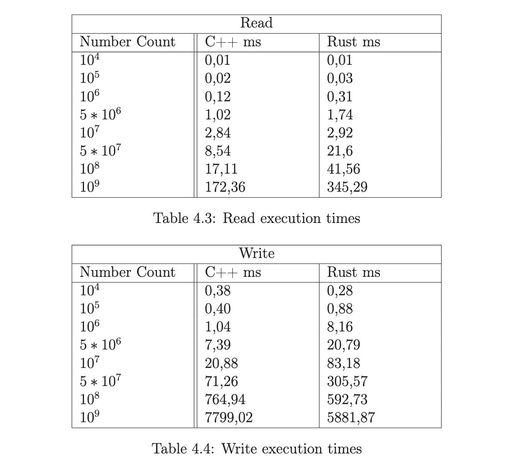
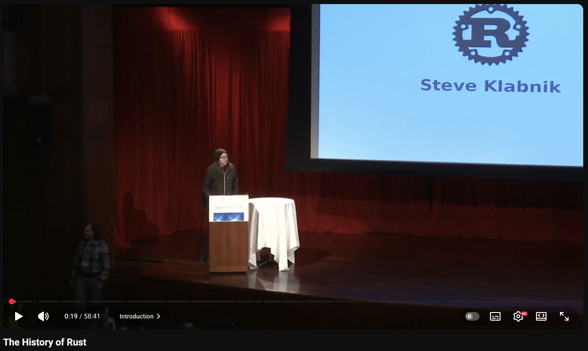
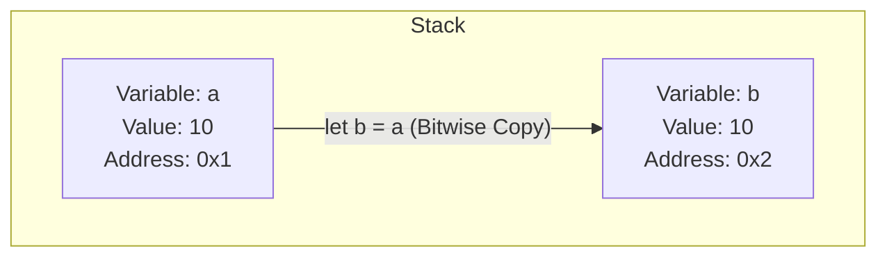
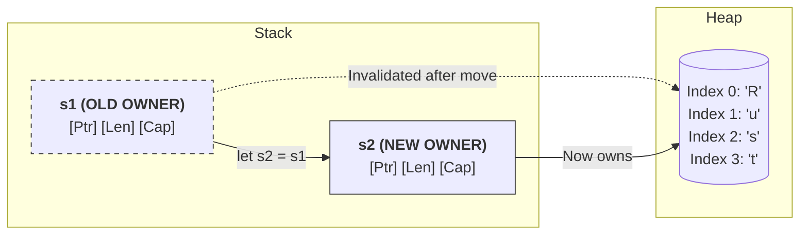
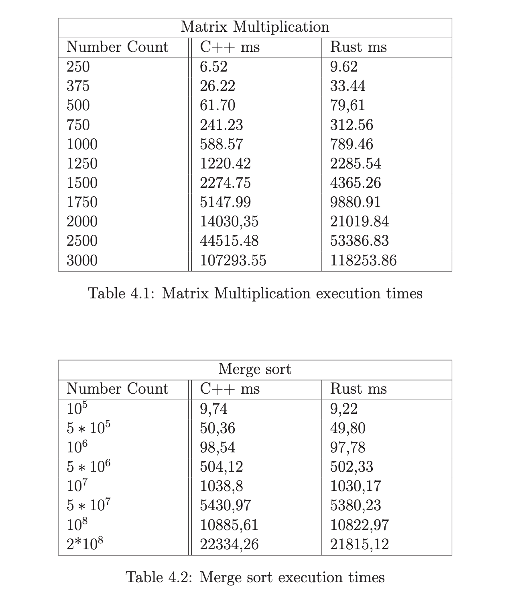

---

title: "Introduction to Rust programming language"
sub_title:
author: Rafał Draws

theme:
  name: tokyonight-storm
  override:
    footer:
      style: template
      center: 'Introduction to Rust programming language'
      right: "{current_slide} / {total_slides}"
      height: 3
    palette:
      classes:
        noice:
          foreground: red
    

---

Agenda
===

- A brief history of Rust
- Memory Safety Core - Ownership, Borrowing, lifetimes
- Typesystem
- Cargo
- Applience


<!-- end_slide -->


Who am I
===
<!-- column_layout: [2, 1] -->
<!-- column: 0 -->

Rafał Draws, MSc. Eng.
<!-- pause -->
- SDE at Nordea Bank 
<!-- pause -->
- Rust Poland co-founder
<!-- pause -->
- Music nerd 
<!-- pause -->
- Automotive nerd 
<!-- pause -->

<!-- column: 1 -->


 
how can you tell that someone drives a Lexus?

<!-- pause -->

they'll tell you

<!-- pause -->


<!-- pause -->
yes its '99, has 300 thousand miles


<!-- end_slide -->


What is Rust?
===

"Rust is a general-purpose programming language. It is noted for its emphasis on performance, type safety, concurrency, and memory safety. 
<!-- pause -->

Rust supports multiple programming paradigms. It was influenced by ideas from functional programming, including immutability, higher-order functions, algebraic data types, and pattern matching.
<!-- pause -->

It also supports object-oriented programming via structs, enums, traits, and methods.

<!-- pause -->

Rust is noted for enforcing memory safety (i.e., that all references point to valid memory) without a conventional garbage collector;
 
instead, memory safety errors and data races are prevented by the "**borrow checker**", which tracks the object lifetime of references at compile time."

~ Wikipedia

<!-- end_slide -->


<!-- column_layout: [1, 2, 1] -->

<!-- column: 1-->
But why Rust?
===

Canadian software developer Graydon Hoare, created Rust in 2006 while working at Mozilla as a side project.

He named the language after a specific type of fungi that is "over-engineered for survival".


<!-- column: 0-->

<!-- column: 1-->
<!-- new_line -->
<!-- new_line -->

<!-- column: 2 -->


<!-- end_slide -->


A brief history of Rust
===

Rust interpreter was first written in OCaml, and the language was inspired by programming languages from 1970-1990s, such as: CLU, BETA, Mesa, NIL, Erlang, Newsqueak, Napier, Hermes, Sather, Limbo and Alef.

<!-- pause -->
Hoare described it as "technology from the past come to save the future from itself".

<!-- pause -->
In 2012, in a interview by InfoQ, upon being asked a question: "Why would developers choose Rust", Graydon answered:

<!-- new_line -->
<!-- new_line -->

<!-- pause -->
<!-- column_layout: [1, 3] -->
<!-- column: 0 -->

<!-- column: 1 -->
- "*Our target audience is "frustrated C++ developers". I mean, that's _us_. So if you are in a similar situation we're in, repeatedly finding yourself forced to pick C++ for systems-level work due to its performance and deployment characteristics, but would like something safer and less painful, we hope we can provide that.*"

<!-- pause -->

And they did. 

<!-- end_slide -->


Rust history over the years
===


- 2006, Rust is created in Mozilla Labs
- 2009, Rust is officially incubated by Mozilla
- 2010, The public reveal at Mozilla Summit
- 2012, Rust is implemented in Rust rather than in OCaml
- 2014, The "Great Simplification", introducing Ownership/Borrowing instead of Garbage Collection
- 2015, Rust 1.0 is released
- 2018, AWS Firecracker was built to power Lambda and Fargate
- 2019, Async/Await stabilization
- 2020, Discord rewrote Read states from Go to Rust to eliminate Garbage Collection spikes && Polars project released
- 2021, Formation of Rust Foundation
- 2022, Rust merged into Linux Kernel && Cloudflare replaced Nginx with Pingora, proxy written in Rust
- 2023, Windows 11 got oxidized, with core parts of Windows kernel (specifically win32k.sys) rewritten in Rust
- 2024, White House endorses Rust explicitly urging the industry to adopt memory safe languages to secure national infrastructure
- 2025, Rust no longer experimental in Linux Kernel

<!-- end_slide -->

The History of Rust, by Steve Klabnik
===



```bash +exec +no_background
echo https://www.youtube.com/watch?v=79PSagCD_AY | qrencode -t utf8i
```

<!-- end_slide -->


How Rust puts emphasis on type safety?
===


1. Functions must take in typed parameters and return type.
2. Ownership and Borrowing System
3. No nulls (instead Option\<T\> and Result\<T, E\>)
4. Immutability by default
5. Exhaustive pattern matching
6. Fearless Concurrency (Send and Sync traits)


<!-- end_slide -->


How Rust puts emphasis on type safety? 
===


1. <span style="color: #00ff11">Functions must take in typed parameters and return type.
2. <span style="color: #00ff11">Ownership and Borrowing System
3. <span style="color: #00ff11">No nulls (instead Option\<T\> and Result\<T, E\>)</span>
4. Immutability by default 
5. <span style="color: #00ff11">**Exhaustive pattern matching**</span>
6. Fearless Concurrency (Send and Sync traits)

<!-- pause -->
Mutability must be defined explicitly with every variable

<!-- pause -->

```rust +exec
# #[allow(unused)]
# fn main() {
  let immutable_string: String = "This is immutable String".to_string();
  
  let mut mutable_string_buffer = "This is mutable".to_string();
  mutable_string_buffer.push_str(", and I can modify it!");

  println!("{}", mutable_string_buffer);
# }
```

<!-- pause -->
And as for 6. Fearless Concurrency - it deserves it's own talk

<!-- end_slide -->


Functions must take in typed parameters and return type. 
===

This won't compile:
```rust +exec
# fn main() {
fn eat_pizza(pizza) {
  if pizza.source == "piratto" {
    return "why did you do this to me"
  }
}
# }

```

<!-- end_slide -->
Functions must take in typed parameters and return type. 
===

This will compile:
```rust +exec
# fn main() {

struct Pizza<'a> {
  source: &'a str
}

fn eat_pizza(pizza: Pizza) {
  if pizza.source == "piratto" {
    println!("mmm yummy")
  } else {
    println!("nice")
  }
}

  let questionmark_pizza: Pizza = Pizza { source: "piratto" };
  eat_pizza(questionmark_pizza);

# }
```
<!-- end_slide -->

Ownership and Borrowing
===

```rust +exec

# fn main() {
  
    let s1 = String::from("Rust"); // s1 owns the memory on the heap

    let s2 = s1; // OWNERSHIP IS MOVED HERE from s1 to s2

    // This line will cause a COMPILE-TIME ERROR
    println!("Value of s1: {}", s1);

# }

```

<!-- pause -->

# But why all of this hassle?

<!-- pause -->

## Well, this or Garbage Collection


<!-- pause -->

# But it works for some types, right? Like i32, u8, &str (string slice)

<!-- pause -->

## This is due to


<!-- pause -->
STACK AND HEAP MEMORY ALLOCATION
===
<!-- end_slide -->

Stack and Heap memory allocation
===



<!-- pause -->
For types like i32, the assignment creates a completely independent twin.
Data on stack is fixed size, and duplicating it is faster than managing a pointer.


<!-- pause -->

<!-- pause -->
This results in invalidation of s1

<!-- pause -->
If both owned the data, they would both try to "drop" (free) that heap memory when the function ends, causing a Double Free crash. By "moving," Rust ensures exactly one variable is responsible for cleaning up.

<!-- pause -->
(Fun fact - NASA dissalows using Heap allocated memory)

<!-- end_slide -->

Ownership and Borrowing (last bit I promise)
===

```rust +exec

# fn main() {
  
    let s1 = String::from("Rust"); // s1 owns the memory on the heap

    let s2 = &s1; // IT CREATES A REFERENCE TO THE HEAP ALLOCATED DATA OWNED BY s1

    // This line will not cause error anymore
    println!("Value of s1: {}", s1);

    // and this is valid as well
    println!("Value of s2: {}, as well", s2);

# }

```


<!-- end_slide -->

No nulls!
===

### Sir Charles Antony Richard Hoare, a british computer scientist, inventor of Quicksort algorithm and grandfather of "design by contract" famously said:


<!-- pause -->

<!-- jump_to_middle -->

<!-- column_layout: [1, 4] -->
<!-- column: 0 -->


<!-- column: 1 -->
<!-- new_line -->
<!-- new_line -->
"I call it my billion-dollar mistake. It was the invention of the null reference in 1965. [...] This has led to innumerable errors, vulnerabilities, and system crashes, which have probably caused a billion dollars of pain and damage in the last forty years."

<!-- end_slide -->

So how do we omit nulls?
===

```rust
Option<T>
Result<Ok, Err>
```

Option of type \<T\> has two wariants, either Some(T) or None.

For example, if you're creating a pizza structure, you could do it this way:


<!-- end_slide -->

Let's make a pizza - inital struct
===

```rust
struct Pizza {
  source: Pizzeria,
  cheese: String,
  meat: Option<Vec<MeatIngridient>>,
  sauce: Option<Sauce>,
  veggies: Option<Veggie>
}

struct MeatIngridient(String)


enum Pizzeria {
  KUBRYK,
  PIRATTO,
  SOPRANO,
  DOLCEVITA,
  PARMA
}


enum Sauce {
  BIANCO,
  ROSSO,
  WLOCLAWEK,
}

struct Veggie(String)

```


<!-- end_slide -->

Let's make a pizza - throw some meat
===

```rust
struct Pizza {
  source: Pizzeria,
  cheese: String,
  meat: Option<Vec<MeatIngridient>>,
  sauce: Option<Sauce>,
  veggies: Option<Veggie>
}

struct MeatIngridient(String)


```


<!-- end_slide -->

Let's make a pizza - source please?
===

```rust
struct Pizza {
  source: Pizzeria,
  cheese: String,
  meat: Option<Vec<MeatIngridient>>,
  sauce: Option<Sauce>,
  veggies: Option<Veggie>
}

struct MeatIngridient(String)

enum Pizzeria {
  KUBRYK,
  PIRATTO,
  SOPRANO,
  DOLCEVITA,
  PARMA
}

```


<!-- end_slide -->
Let's make a pizza - source please?
===

```rust
struct Pizza {
  source: Pizzeria,
  cheese: String,
  meat: Option<Vec<MeatIngridient>>,
  sauce: Option<Sauce>,
  veggies: Option<Veggie>
}

struct MeatIngridient(String)

enum Pizzeria {
  KUBRYK,
  PIRATTO,
  SOPRANO,
  DOLCEVITA,
  PARMA
}

enum Sauce {
  BIANCO,
  ROSSO,
  WLOCLAWEK,
}

struct Veggie(String)

```


<!-- end_slide -->

Ok, so how did the Cloudflare famously crashed?
===

```


```

<!-- end_slide -->

# 1. Why write in Rust when you can achieve the same in Python?

1. Resources matter
2. Upfront best practices enforced by compiler
3. Community


<!-- end_slide -->

# 1a. Resources matter




Performance evaluation for choosing
between Rust and C++ - Patrik Karlsson, p.16 2023

https://www.diva-portal.org/smash/get/diva2:1761754/FULLTEXT01.pdf


<!-- end_slide -->

# 1b. Resources matter


Performance evaluation for choosing
between Rust and C++ - Patrik Karlsson, p.17 2023

https://www.diva-portal.org/smash/get/diva2:1761754/FULLTEXT01.pdf


<!-- end_slide -->

# 2. Why write in Rust when you can achieve the same in C?

1. Compiler support
2. Upfront best practices enforced by compiler
3. Cargo


<!-- end_slide -->

# 3. You mentioned upfront best practices enforced by compiler, what exactly do you mean bud?

- Structs and enums are first class citizens of Rust
- Explicit type checks
- Ownership model
- RAII
- data-race-free concurrency
- Option`<T>`, Result`<T, E>`


<!-- end_slide -->

#5. Why compiling is worth it and why Rust is superb at it?

1. compiled software is faster - It's just binary code ready for your computer to interpret, and in rust example - you can set optimization levels from 0 to 3.
2. When you run .py script - you just execute it using python interepreter, and if you were to run this script on another device, you would have to make sure that the other device has the same or higher version of python with the same requirements
3. Operating systems have different ways to acquire memory, play a sound, or print something on screen. These instructions are SYSCALLs, and if you ever wondered how can you use software specific for Windows - "wine" translates Windows Syscalss to Linux/Unix ones.

Therefore, if you compile executable for linux, you won't be able to run it on Windows machine!


<!-- end_slide -->

#6. Enter cargo

1. It is package manager, toolchain manager, compiler CLI, documentation tool and testing suite.
2. Imagine requirements.txt but with project metadata and workspace manager.
3. Cargo also allows you to run, check (compilation without running the code), test and much, much more. There's a whole book about cargo.
4. Cargo let's you install toolchains - If you're on linux, you can specify windows with an ARM processor as compilation target. You can copy/send the executable and it will run smoothly on specified machine, as long as it's exact toolchain for the system.
5. Wonderful compiler errors.


<!-- end_slide -->

#7. Enough with the yapping, explain the ownership please.

Rust started of after one of Mozilla employees had it enough with broken elevator, which was crashing due to memory allocation bug. The idea of memory-safe language was born.

Your computer has two ways to store variables.

Stack and Heap.

Stack is a "plate-like structure" that allows for Last-In First-Out access, while
Heap has "just put it somewhere idc" structure. 

Languages like Python doesn't bother the developers with deciding where to store the variables, but if you were to develop something in C - you would.

